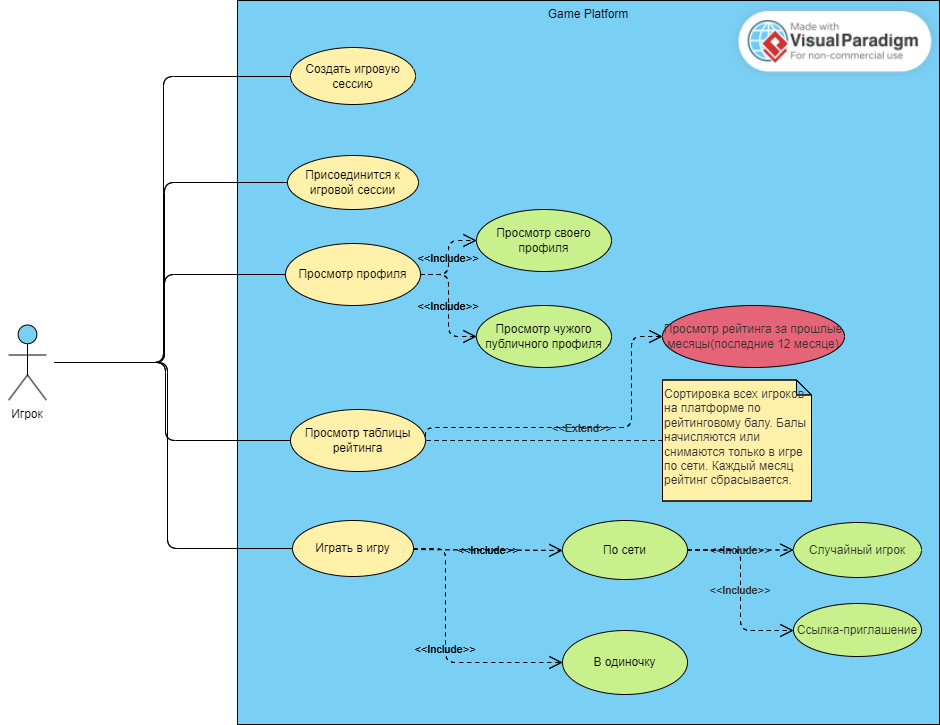
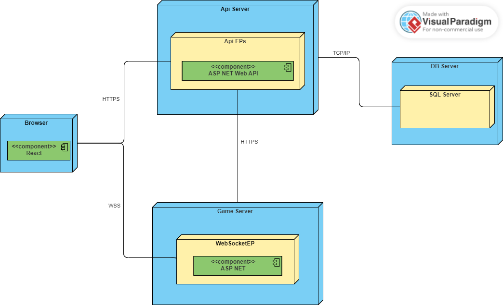

## 1. Тема.
"Разработка игровой платформы для соревнования игроков."

## 2. UseCase диаграмма.

## 3. Структура.

## 4. Используемые технологии.
- Языки
  - C#
  - JavaScript
- Фреймворки/библиотеки
  - React
  - ASP Net
  - Entity Framework
- Инструменты разработки
  - GIT
